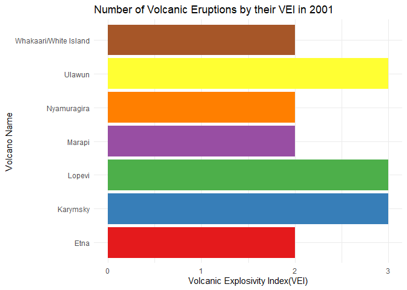

<!-- README.md is generated from README.Rmd. Please edit that file -->

# eruptR

<!-- badges: start -->
<!-- badges: end -->

The goal of eruptR is to analyse and comprehend volcanic explosivity
trends. Users can use this function to query the dataset using volcano
names and receive data linked to the Volcano Explosivity Index (VEI).
The dataset includes not only the categorising and features of these
volcanoes but also detailed information regarding their eruptions across
time.

There are a number of functions included in the package that can help
answer questions such as:

- How to generate a Fibonacci series of a given input?
- What does the Volcanic Explosivity Index (VEI) indicate for a
  particular volcano during a specific year?
- What is the highest Volcanic Explosivity index of the top volcanoes
  for that input year?
- The package also includes a method that executes a shiny application
  designed to assess various elements of the data.

## Installation

You can install the development version of eruptR from
[GitHub](https://github.com/) with:

``` r
# install.packages("devtools")
devtools::install_github("ETC5523-2023/rpkg-akanksha03042001")
```

This command is used to load the package library -

``` r
library(eruptR)
#> 
#> Attaching package: 'eruptR'
#> The following object is masked from 'package:datasets':
#> 
#>     volcano
```

## Example

- **fibonacci_sequence** - When given a specific number as input, the
  numerical function displays the Fibonacci series up to that particular
  input number.

``` r
fibonacci_series(10)
#>  [1]  0  1  1  2  3  5  8 13 21 34
```

- **explosive_index** - A function that takes a year as input and
  returns the name of the volcano as well as the maximum recorded
  Volcanic Explosivity Index (VEI) for that year.

``` r
explosive_index(2011)
#> # A tibble: 1 × 2
#>     vei volcano_name         
#>   <dbl> <chr>                
#> 1     5 Puyehue-Cordon Caulle
```

- **volcanic_eruption_counts** - A parameterized R Shiny function that
  takes in a year and creates a figure demonstrating the relationship
  between Volcanic Explosivity Index (VEI) and volcano names.

``` r
volcanic_eruption_counts(2001)
```



- **Launching Shiny App** - A function which launches a R-shiny app from
  the package.

``` r
run_app()
```
